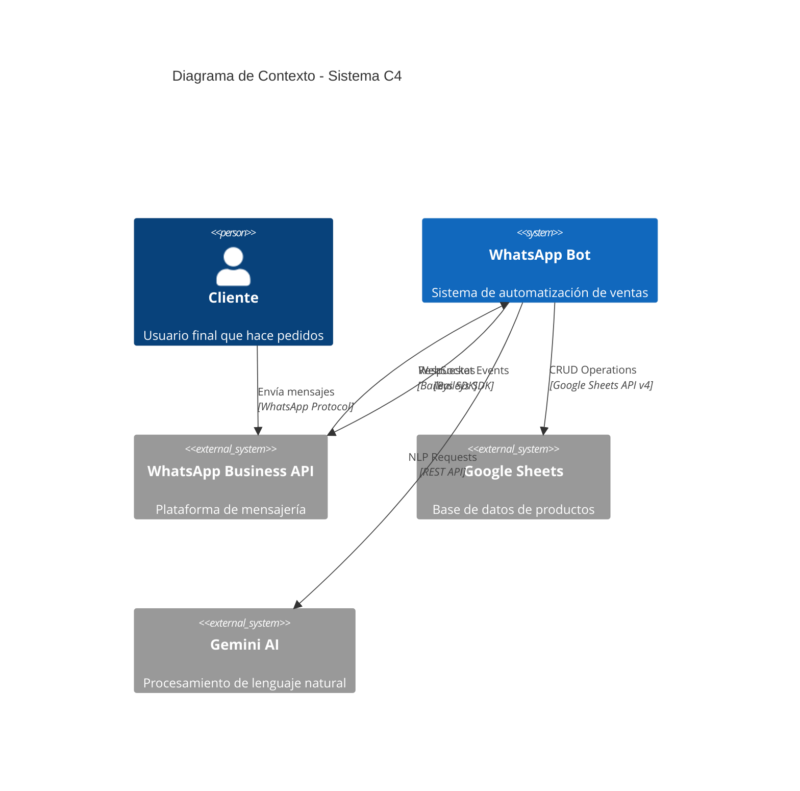
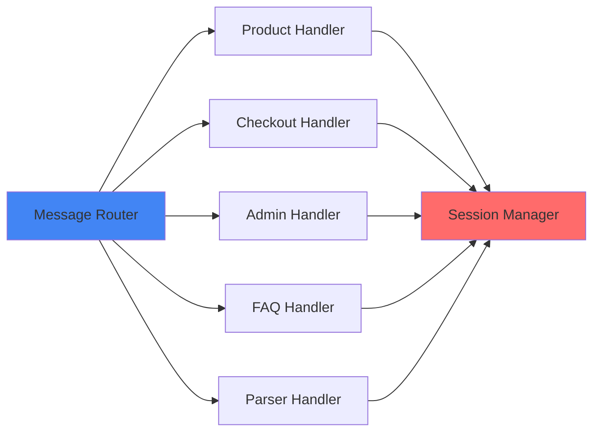
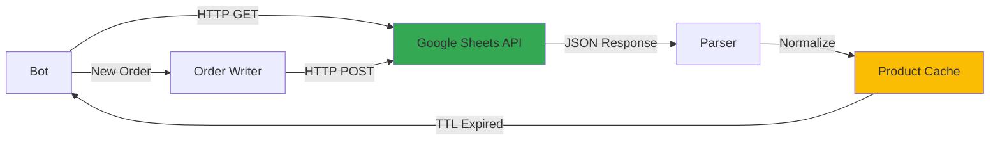
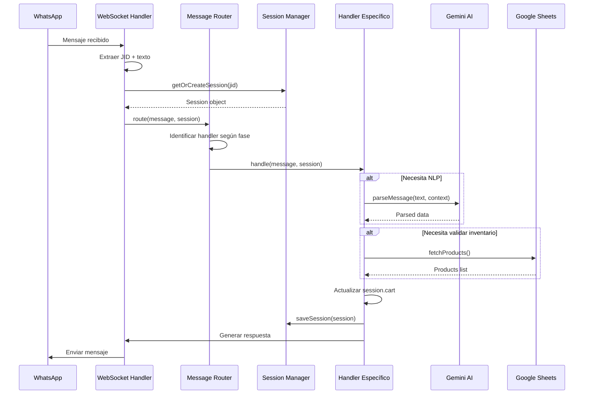
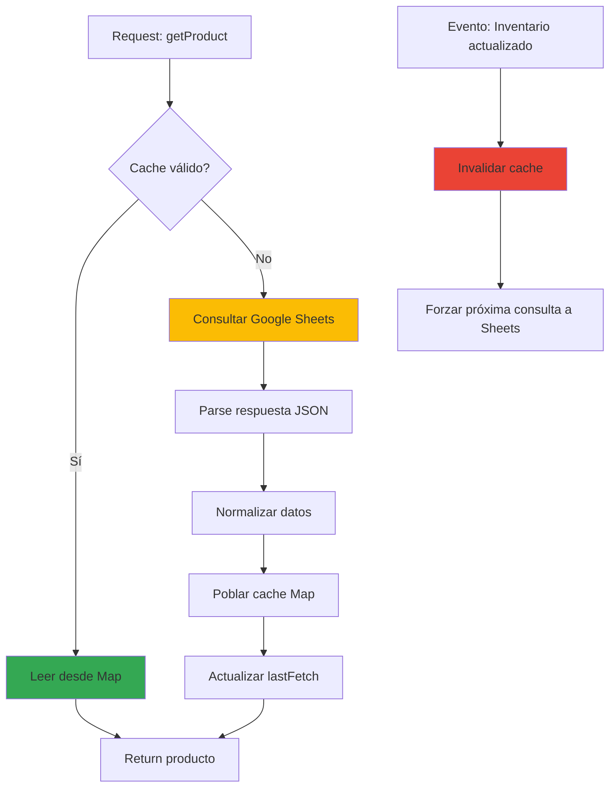
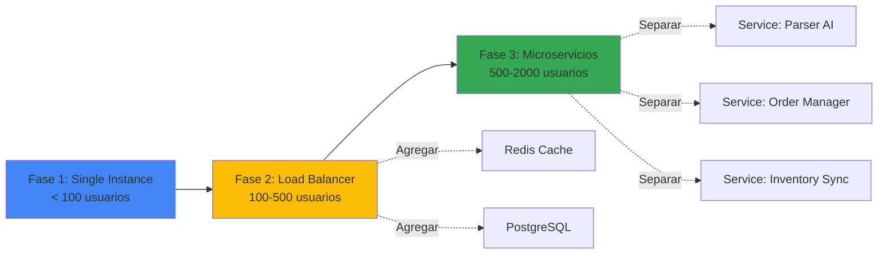
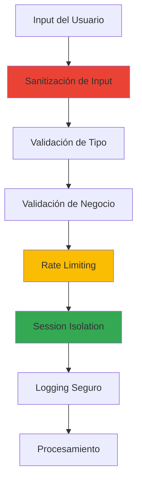

# 🏗️ Arquitectura Técnica Detallada - Mundo Helados Bot

## 📑 Tabla de Contenidos

1. [Visión General del Sistema](#visión-general-del-sistema)
2. [Capas de Arquitectura](#capas-de-arquitectura)
3. [Patrones de Diseño Implementados](#patrones-de-diseño-implementados)
4. [Flujos de Datos Críticos](#flujos-de-datos-críticos)
5. [Decisiones Técnicas y Trade-offs](#decisiones-técnicas-y-trade-offs)
6. [Escalabilidad y Performance](#escalabilidad-y-performance)

---

## 🌐 Visión General del Sistema

### **Arquitectura de Alto Nivel**



### **Componentes Principales**

| Componente | Responsabilidad | Tecnología |
|------------|----------------|------------|
| **WebSocket Handler** | Conexión persistente con WhatsApp | Baileys SDK |
| **Session Manager** | Gestión de estado conversacional | Map in-memory |
| **Message Router** | Despacho de mensajes a handlers | Event-driven pattern |
| **Product Cache** | Cache de inventario | TTL-based cache |
| **Fuzzy Search Engine** | Búsqueda tolerante a errores | Algoritmo de Levenshtein |
| **NLP Parser** | Interpretación de lenguaje natural | Google Gemini AI |
| **Validation Layer** | Validación de datos de negocio | Custom validators |

---

## 🏛️ Capas de Arquitectura

### **Modelo de 4 Capas**

```mermaid
graph TD
    subgraph "Capa de Presentación"
        A[WhatsApp Client]
    end
    
    subgraph "Capa de Aplicación"
        B[Message Router]
        C[Handlers<br/>Product | Checkout | Admin]
        D[Session Manager]
    end
    
    subgraph "Capa de Negocio"
        E[Business Logic]
        F[Fuzzy Search]
        G[Validation Rules]
        H[Price Calculator]
    end
    
    subgraph "Capa de Datos"
        I[Google Sheets API]
        J[Product Cache]
        K[Session Storage]
    end
    
    A --> B
    B --> C
    C --> D
    C --> E
    E --> F
    E --> G
    E --> H
    E --> I
    E --> J
    D --> K
    
    style A fill:#25D366
    style B fill:#4285F4
    style C fill:#339933
    style E fill:#FF6B6B
    style I fill:#34A853
```

### **1. Capa de Presentación (WhatsApp Interface)**

**Responsabilidades:**
- Renderizado de mensajes con formato (negrita, emojis, listas)
- Conversión de respuestas del bot a formato WhatsApp
- Manejo de tipos de mensaje (texto, imagen, documento)

**Tecnologías:**
- Baileys SDK para protocolo WhatsApp
- Markdown-to-WhatsApp formatter

**Código de Ejemplo (Público):**
```javascript
// Formateador de mensajes
function formatWhatsAppMessage(data) {
    const { type, content, options } = data;
    
    switch(type) {
        case 'menu':
            return `*${content.title}*\n\n` +
                   content.items.map((item, i) => 
                       `*${i+1}.* ${item.name} - ${item.price}`
                   ).join('\n');
        
        case 'confirmation':
            return `✅ *${content.title}*\n\n` +
                   `${content.summary}\n\n` +
                   `Responde *SI* para confirmar`;
        
        default:
            return content.text;
    }
}
```

---

### **2. Capa de Aplicación (Orquestación)**

**Responsabilidades:**
- Routing de mensajes a handlers específicos
- Gestión de sesiones de usuario
- Control de flujo conversacional
- Logging y monitoreo

**Estructura de Handlers:**



**Session State Schema:**
```javascript
{
    jid: "573001234567@s.whatsapp.net",
    phase: "SELECCION_SABOR",
    cart: [
        {
            productId: "copa-helado",
            productName: "Copa de Helado",
            quantity: 2,
            mode: "per_unit",
            units: [
                {
                    sabores: ["chocolate", "vainilla"],
                    toppings: ["brownie"]
                },
                {
                    sabores: ["fresa", "lucuma"],
                    toppings: []
                }
            ],
            totalPrice: 10000
        }
    ],
    order: {
        deliveryAddress: null,
        deliveryCost: 0,
        customerName: null,
        phone: "573001234567"
    },
    context: {
        pendingProduct: null,
        pendingSabores: [],
        pendingToppings: [],
        errorCount: 0,
        lastActivity: 1703456789000
    }
}
```

---

### **3. Capa de Negocio (Lógica Core)**

**Componentes Críticos:**

#### **A. Fuzzy Search Engine**

```javascript
// Algoritmo de Levenshtein (versión simplificada)
function levenshteinDistance(str1, str2) {
    const m = str1.length;
    const n = str2.length;
    const dp = Array(m + 1).fill(null).map(() => Array(n + 1).fill(0));
    
    // Inicialización
    for (let i = 0; i <= m; i++) dp[i][0] = i;
    for (let j = 0; j <= n; j++) dp[0][j] = j;
    
    // Programación dinámica
    for (let i = 1; i <= m; i++) {
        for (let j = 1; j <= n; j++) {
            if (str1[i-1] === str2[j-1]) {
                dp[i][j] = dp[i-1][j-1];
            } else {
                dp[i][j] = 1 + Math.min(
                    dp[i-1][j],    // Eliminación
                    dp[i][j-1],    // Inserción
                    dp[i-1][j-1]   // Sustitución
                );
            }
        }
    }
    
    return dp[m][n];
}

// Convertir distancia a score de similitud
function similarityScore(str1, str2) {
    const maxLen = Math.max(str1.length, str2.length);
    if (maxLen === 0) return 1.0;
    
    const distance = levenshteinDistance(str1, str2);
    return 1 - (distance / maxLen);
}
```

**Complejidad:** O(n × m) donde n, m son longitudes de strings  
**Optimización:** Pre-normalización de strings (lowercase + sin acentos)

---

#### **B. Price Calculator**

```javascript
// Calculador de precios con reglas de negocio
class PriceCalculator {
    constructor(priceRules) {
        this.rules = priceRules;
    }
    
    calculateItemPrice(item) {
        let basePrice = item.product.price;
        
        // Precio de sabores (si aplica)
        if (item.product.type === 'customizable') {
            const saborPrice = this.getSaborPrice(item.sabores);
            basePrice += saborPrice;
        }
        
        // Precio de toppings
        const toppingPrice = item.toppings.reduce((sum, topping) => {
            return sum + (topping.price || 0);
        }, 0);
        
        // Subtotal por unidad
        const unitPrice = basePrice + toppingPrice;
        
        // Total con cantidad
        return unitPrice * item.quantity;
    }
    
    calculateOrderTotal(cart, deliveryCost = 0) {
        const itemsTotal = cart.reduce((sum, item) => {
            return sum + this.calculateItemPrice(item);
        }, 0);
        
        return itemsTotal + deliveryCost;
    }
    
    // Reglas especiales (descuentos, promociones)
    applyPromotions(cart) {
        // Ejemplo: 2x1 en copas los martes
        if (this.isTuesday() && cart.some(item => item.product.category === 'copas')) {
            // Lógica de descuento
        }
    }
}
```

---

#### **C. Validation Layer**

```javascript
// Validadores de negocio
const validators = {
    // Validar cantidad solicitada
    quantity: (value, product) => {
        const num = parseInt(value);
        
        if (isNaN(num) || num < 1) {
            return { valid: false, error: 'Cantidad debe ser un número positivo' };
        }
        
        if (num > 50) {
            return { valid: false, error: 'Cantidad máxima: 50 unidades. Para pedidos mayores, contacta un agente.' };
        }
        
        // Validar stock
        if (product.stock !== null && num > product.stock) {
            return { valid: false, error: `Solo quedan ${product.stock} unidades disponibles` };
        }
        
        return { valid: true, value: num };
    },
    
    // Validar dirección de entrega
    address: (value) => {
        if (!value || value.trim().length < 10) {
            return { valid: false, error: 'La dirección debe tener al menos 10 caracteres' };
        }
        
        // Validar que contenga número de casa/apto
        const hasNumber = /\d+/.test(value);
        if (!hasNumber) {
            return { valid: false, error: 'Por favor incluye el número de casa/apartamento' };
        }
        
        return { valid: true, value: value.trim() };
    },
    
    // Validar selección de sabores
    sabores: (selected, product) => {
        const required = product.saboresRequeridos || 2;
        
        if (selected.length < required) {
            return { 
                valid: false, 
                error: `Debes seleccionar ${required} sabores. Tienes ${selected.length}` 
            };
        }
        
        if (selected.length > required) {
            return { 
                valid: false, 
                error: `Solo puedes seleccionar ${required} sabores` 
            };
        }
        
        return { valid: true, value: selected };
    }
};
```

---

### **4. Capa de Datos (Persistencia)**

#### **Integración con Google Sheets**



**Estructura de Hojas:**

**1. Hoja "Productos"**
| ID | NombreProducto | Precio_Venta | Categoria | Stock | Sabores_Req | Imagen_URL |
|----|----------------|--------------|-----------|-------|-------------|------------|
| 1 | Copa de Helado | 5000 | Helados | ∞ | 2 | https://... |
| 2 | Paleta de Chocolate | 3000 | Paletas | 50 | 0 | https://... |

**2. Hoja "Sabores"**
| ID | NombreProducto | Categoria | Disponible |
|----|----------------|-----------|------------|
| 1 | Chocolate | Clásico | TRUE |
| 2 | Vainilla | Clásico | TRUE |
| 3 | Lúcuma | Premium | TRUE |

**3. Hoja "Toppings"**
| ID | NombreProducto | Precio_Venta | Disponible |
|----|----------------|--------------|------------|
| 1 | Brownie | 1000 | TRUE |
| 2 | Chispas de Chocolate | 500 | TRUE |

**4. Hoja "Pedidos"** (Auto-generada)
| Timestamp | ID_Pedido | Cliente | Telefono | Items | Total | Dirección | Estado |
|-----------|-----------|---------|----------|-------|-------|-----------|--------|
| 2024-12-24 10:30 | ORD-001 | Juan Pérez | +57300... | [...] | $12,000 | Calle 123 | PENDING |

---

## 🎨 Patrones de Diseño Implementados

### **1. State Machine Pattern**

```javascript
class ConversationStateMachine {
    constructor() {
        this.transitions = {
            'INICIO': ['SELECCION_OPCION'],
            'SELECCION_OPCION': ['SELECCION_SABOR', 'BROWSE_IMAGES', 'FAQ', 'CANCELAR'],
            'SELECCION_SABOR': ['SELECCION_TOPPING', 'CANTIDAD_ITEM'],
            'SELECCION_TOPPING': ['SOLICITUD_DIRECCION', 'CANTIDAD_ITEM'],
            'SOLICITUD_DIRECCION': ['CONFIRMACION_PEDIDO'],
            'CONFIRMACION_PEDIDO': ['PROCESANDO_PAGO', 'SELECCION_OPCION'],
            'PROCESANDO_PAGO': ['PEDIDO_FINALIZADO'],
            'PEDIDO_FINALIZADO': ['INICIO'],
            'CANCELAR': ['INICIO']
        };
    }
    
    canTransition(currentState, nextState) {
        return this.transitions[currentState]?.includes(nextState) || false;
    }
    
    transition(session, nextState) {
        if (!this.canTransition(session.phase, nextState)) {
            throw new Error(`Invalid transition: ${session.phase} → ${nextState}`);
        }
        
        session.phase = nextState;
        session.context.lastTransition = Date.now();
    }
}
```

---

### **2. Strategy Pattern (Handlers)**

```javascript
// Interfaz de handler
class MessageHandler {
    canHandle(message, session) {
        throw new Error('Must implement canHandle()');
    }
    
    async handle(sock, message, session) {
        throw new Error('Must implement handle()');
    }
}

// Implementaciones concretas
class ProductSelectionHandler extends MessageHandler {
    canHandle(message, session) {
        return session.phase === 'SELECCION_OPCION';
    }
    
    async handle(sock, message, session) {
        // Lógica específica de selección de producto
    }
}

class CheckoutHandler extends MessageHandler {
    canHandle(message, session) {
        return session.phase === 'CONFIRMACION_PEDIDO';
    }
    
    async handle(sock, message, session) {
        // Lógica de checkout
    }
}

// Router que usa las estrategias
class MessageRouter {
    constructor() {
        this.handlers = [
            new ProductSelectionHandler(),
            new CheckoutHandler(),
            // ... más handlers
        ];
    }
    
    async route(sock, message, session) {
        const handler = this.handlers.find(h => h.canHandle(message, session));
        
        if (!handler) {
            throw new Error('No handler found for current state');
        }
        
        return handler.handle(sock, message, session);
    }
}
```

---

### **3. Cache Aside Pattern**

```javascript
class ProductCache {
    constructor(dataSource, ttl = 5 * 60 * 1000) {
        this.cache = new Map();
        this.dataSource = dataSource;
        this.ttl = ttl;
        this.lastFetch = null;
    }
    
    async get(key) {
        // 1. Intentar leer desde cache
        if (this.isCacheValid() && this.cache.has(key)) {
            console.log(`Cache HIT: ${key}`);
            return this.cache.get(key);
        }
        
        // 2. Cache MISS → consultar fuente de datos
        console.log(`Cache MISS: ${key}`);
        await this.loadAll();
        
        return this.cache.get(key);
    }
    
    async loadAll() {
        const data = await this.dataSource.fetchAll();
        
        this.cache.clear();
        data.forEach(item => this.cache.set(item.id, item));
        this.lastFetch = Date.now();
        
        console.log(`Cache refreshed: ${this.cache.size} items`);
    }
    
    isCacheValid() {
        if (!this.lastFetch) return false;
        return (Date.now() - this.lastFetch) < this.ttl;
    }
    
    invalidate() {
        this.lastFetch = null;
    }
}
```

---

### **4. Observer Pattern (Event Emitters)**

```javascript
const EventEmitter = require('events');

class OrderEventEmitter extends EventEmitter {
    emitOrderCreated(order) {
        this.emit('order:created', order);
    }
    
    emitOrderCompleted(order) {
        this.emit('order:completed', order);
    }
    
    emitOrderCancelled(order) {
        this.emit('order:cancelled', order);
    }
}

// Suscriptores
const orderEvents = new OrderEventEmitter();

orderEvents.on('order:created', async (order) => {
    // Notificar administradores
    await notifyAdmins(order);
});

orderEvents.on('order:completed', async (order) => {
    // Registrar en Google Sheets
    await logToSheets(order);
    
    // Enviar confirmación al cliente
    await sendConfirmation(order.phone);
});

orderEvents.on('order:cancelled', async (order) => {
    // Liberar inventario (si aplica)
    await releaseStock(order.items);
});
```

---

## 🔄 Flujos de Datos Críticos

### **Flujo 1: Procesamiento de Mensaje Entrante**



---

### **Flujo 2: Sistema de Cache de Productos**



---

## ⚖️ Decisiones Técnicas y Trade-offs

### **1. Baileys vs WhatsApp Business API Oficial**

| Aspecto | Baileys (Elegido) | API Oficial |
|---------|-------------------|-------------|
| **Costo** | ✅ Gratis | ❌ $0.005-0.01 por mensaje |
| **Aprobación** | ✅ No requiere | ❌ Proceso de verificación |
| **Estabilidad** | ⚠️ Media (cambios frecuentes en WA) | ✅ Alta |
| **Features** | ✅ Acceso completo | ⚠️ Limitado por política |
| **Riesgo de Ban** | ⚠️ Posible si hay spam | ✅ Bajo |

**Decisión:** Baileys para MVP y clientes pequeños. Migrar a API oficial si escala > 10K mensajes/mes.

---

### **2. Google Sheets vs Base de Datos Relacional**

| Aspecto | Google Sheets (Elegido) | PostgreSQL/MySQL |
|---------|-------------------------|------------------|
| **Setup Inicial** | ✅ 5 minutos | ❌ 2-4 horas |
| **Costo** | ✅ Gratis (hasta 10M cells) | ⚠️ Hosting requerido |
| **UI para Cliente** | ✅ Excel-like (familiar) | ❌ Requiere admin panel |
| **Performance** | ⚠️ Lento si > 10K filas | ✅ Muy rápido |
| **Escalabilidad** | ❌ Limitado (max 5M cells) | ✅ Ilimitado |
| **Backups** | ✅ Automáticos (Google Drive) | ⚠️ Manual |

**Decisión:** Sheets para MVP. Cache agresivo mitiga latencia. Migrar a DB si catálogo > 500 productos.

---

### **3. Gemini AI vs GPT-4 para NLP**

| Aspecto | Gemini (Elegido) | GPT-4 |
|---------|------------------|-------|
| **Costo** | ✅ $0.00025/1K tokens | ❌ $0.03/1K tokens (120x más caro) |
| **Latencia** | ✅ 200-500ms | ⚠️ 800-1500ms |
| **Precisión** | ⚠️ 88% | ✅ 95% |
| **Límite de Rate** | ✅ 60 req/min (gratis) | ❌ Requiere pago |
| **Context Window** | ✅ 32K tokens | ✅ 128K tokens |

**Decisión:** Gemini para control de costos. Fallback a reglas si confianza < 70%.

---

## 📈 Escalabilidad y Performance

### **Benchmarks Actuales**

| Métrica | Valor Actual | Objetivo < 6 meses |
|---------|--------------|---------------------|
| Mensajes/seg | 5 | 20 |
| Sesiones concurrentes | 100 | 500 |
| Latencia P95 (respuesta) | 450ms | 200ms |
| Uptime | 99.5% | 99.9% |
| Cache hit rate | 95% | 98% |
| Uso de memoria (100 sesiones) | 150MB | 100MB |

### **Cuellos de Botella Identificados**

1. **Google Sheets API Calls**
   - **Actual:** 2-3 segundos en cold start
   - **Solución:** Cache de 5 minutos + pre-carga al inicio

2. **Algoritmo de Levenshtein**
   - **Actual:** 15ms para catálogo de 50 productos
   - **Solución:** Índice invertido + n-grams para búsquedas > 100 productos

3. **Session Garbage Collection**
   - **Actual:** Bloquea thread principal cada 5 minutos
   - **Solución:** Worker threads para GC asíncrono

### **Plan de Escalamiento**



---

## 🔐 Seguridad en Profundidad

### **Capas de Seguridad**



**Implementaciones:**

1. **Input Sanitization**
```javascript
function sanitizeInput(text) {
    // Remover caracteres peligrosos
    return text
        .replace(/[<>]/g, '')  // Prevenir HTML injection
        .replace(/[;$`]/g, '') // Prevenir shell injection
        .trim()
        .substring(0, 500);    // Limitar longitud
}
```

2. **Rate Limiting**
```javascript
const rateLimiter = new Map();

function checkRateLimit(jid) {
    const now = Date.now();
    const userLimit = rateLimiter.get(jid) || { count: 0, resetAt: now + 60000 };
    
    if (now > userLimit.resetAt) {
        userLimit.count = 0;
        userLimit.resetAt = now + 60000;
    }
    
    userLimit.count++;
    rateLimiter.set(jid, userLimit);
    
    return userLimit.count <= 10; // Max 10 mensajes/minuto
}
```

---

## 📚 Referencias Técnicas

- [Baileys SDK Documentation](https://github.com/WhiskeySockets/Baileys)
- [Google Sheets API v4](https://developers.google.com/sheets/api/reference/rest)
- [Gemini AI API Reference](https://ai.google.dev/docs)
- [State Machine Pattern (Gang of Four)](https://refactoring.guru/design-patterns/state)
- [Levenshtein Distance Algorithm](https://en.wikipedia.org/wiki/Levenshtein_distance)

---

**Última actualización:** Diciembre 2024  
**Versión del documento:** 1.0.0
